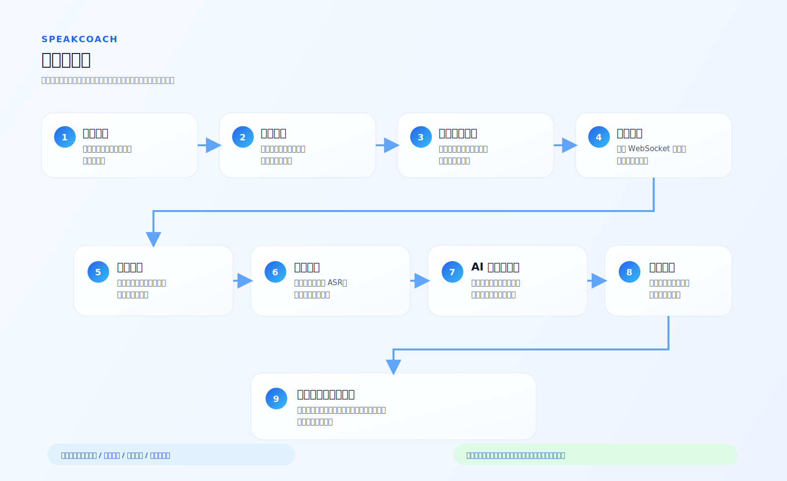
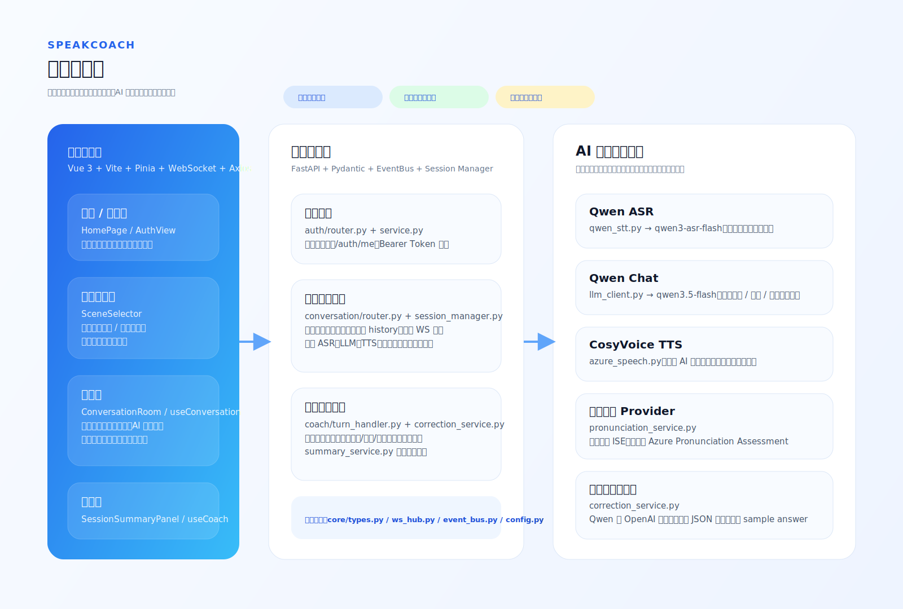

# SpeakCoach

SpeakCoach 是一个面向英语口语训练的 AI 陪练项目，支持用户在固定场景或自定义场景中进行英文对话练习，并在练习结束后查看发音、纠错与总结反馈。

当前版本已经打通了从登录、场景选择、实时录音、语音识别、AI 回答、发音反馈到课后总结的完整闭环。

## Demo 视频

视频地址：[SpeakCoach Demo 演示](https://www.bilibili.com/video/BV1exEb6XEZt/?share_source=copy_web&vd_source=28fb97ec522502dcc3774cbc18124f97)

本视频展示了登录注册、场景选择、实时语音对话、发音评测、表达纠错、课后报告和 Shadowing 跟读训练等核心功能。

## 项目亮点

- 支持固定场景：求职面试、餐厅点餐、商务会议
- 支持自定义场景：用户可输入背景，AI 按背景继续追问
- 支持三档难度：入门、进阶、困难
- 支持实时语音练习：浏览器录音上传，后端识别并生成回复
- 支持 AI 场景化追问：根据场景、难度、历史对话继续互动
- 支持发音评测：可走讯飞 ISE 或 Azure Pronunciation Assessment
- 支持语法 / 表达 / 词汇纠错与推荐表达
- 支持练习总结：汇总发音均分、纠错统计、重点词与逐轮回看

## 功能流程图



## 技术支撑图



## 功能流说明

1. 用户进入首页，查看产品介绍并选择登录或开始体验。
2. 登录成功后进入练习入口页，选择固定场景或输入自定义背景。
3. 用户选择难度等级，创建会话并建立 WebSocket 连接。
4. 用户点击开始说话，浏览器采集音频并上传到后端。
5. 后端进行音频格式转换与语音识别，得到英文转写文本。
6. 后端将转写文本、场景、难度和历史对话交给大模型生成下一轮回复。
7. 后端异步执行发音评测与纠错分析，并通过 WebSocket 推送到前端分析栏。
8. 同时后端调用 TTS 合成 AI 回复语音，前端自动播放。
9. 用户结束对话后，前端拉取总结结果，查看分数、重点词、纠错和逐轮记录。

## 技术架构

### 前端

- `Vue 3`：页面与组件渲染
- `Vite`：开发与构建
- `Pinia`：全局状态管理
- `Axios`：HTTP 请求
- `WebSocket`：实时会话通信
- `Tailwind CSS`：界面样式与布局

### 后端

- `FastAPI`：HTTP / WebSocket 服务
- `Pydantic`：数据模型与接口协议
- `EventBus`：对话模块与教练模块之间的异步事件联动
- `Session Manager`：维护会话状态、轮次、历史对话与音频片段

### 语音与大模型能力

- `Qwen ASR (qwen3-asr-flash)`：英文语音识别
- `Qwen Chat (qwen3.5-flash)`：场景化英文对话生成
- `CosyVoice (cosyvoice-v3-flash)`：AI 回复语音合成
- `讯飞 ISE / Azure Speech`：发音评测
- `Qwen / OpenAI 兼容模型`：语法、表达、词汇纠错
- `ffmpeg + pydub`：音频解码、转码与标准化

## 目录结构

```text
QiNiu/
├─ backend/                  # FastAPI 后端
│  └─ app/
│     ├─ core/               # 配置、共享类型、事件总线、WS Hub
│     └─ modules/
│        ├─ auth/            # 登录注册与鉴权
│        ├─ conversation/    # 对话、语音识别、LLM 回复、TTS
│        └─ coach/           # 发音评测、纠错、总结、跟读
├─ frontend/                 # Vue 3 前端
│  └─ src/
│     ├─ core/               # store、协议类型、ws 封装、音频工具
│     └─ modules/
│        ├─ home/            # 首页
│        ├─ auth/            # 登录页
│        ├─ conversation/    # 场景页、会话页
│        └─ coach/           # 实时分析与总结页
├─ docs/
│  └─ diagrams/              # README 引用的流程图
├─ requirements.txt          # Python 依赖清单
└─ ai-coding/                # 规划与设计文档
```

## 环境准备

### 1. Python 环境

推荐使用 Python `3.10+`。

如果你使用 Conda，可以先创建并激活环境：

```powershell
conda create -n qniu python=3.10 -y
conda activate qniu
```

如果你不使用 Conda，也可以直接使用系统 Python 或虚拟环境。

### 2. 安装后端依赖

从仓库根目录执行：

```powershell
pip install -r requirements.txt
```

如果你希望以后继续开发这个后端，也可以用可编辑模式安装：

```powershell
pip install -e backend
```

### 3. 安装前端依赖

从仓库根目录执行：

```powershell
cd frontend
npm install
```

## 启动命令

下面的命令都默认你当前位于仓库根目录。

### 后端一条命令

```powershell
cd backend; uvicorn app.main:app --reload --port 8000
```

如果你使用 Conda 环境，也可以这样启动：

```powershell
conda run -n qniu uvicorn app.main:app --reload --port 8000
```

### 前端一条命令

```powershell
cd frontend; npm run dev
```

启动后访问：

- 前端：`http://localhost:5173`
- 后端健康检查：`http://localhost:8000/health`

## 使用说明

1. 打开首页，点击 `登录` 或 `开始体验`
2. 登录后进入练习入口页
3. 选择固定场景，或填写自定义场景背景
4. 选择难度：入门 / 进阶 / 困难
5. 开始会话后点击 `开始说话`
6. 说一句英文，等待系统完成识别与 AI 回复
7. 观察右侧分析栏中的发音反馈与纠错建议
8. 点击 `结束对话`
9. 在总结页查看总体得分、重点词、纠错和逐轮记录

## 主要接口

### 鉴权接口

- `POST /auth/register`
- `POST /auth/login`
- `GET /auth/me`
- `POST /auth/logout`

### 会话接口

- `GET /api/sessions/{session_id}/status`
- `POST /sessions/{session_id}/summary`
- `GET /sessions/{session_id}/shadowing/items`
- `POST /sessions/{session_id}/shadowing/assess`
- `POST /shadowing/tts`
- `WS /ws/session/{session_id}`

### WebSocket 关键消息

- 客户端发送：
  - `session.start`
  - `audio.append`
  - `session.finish`
- 服务端返回：
  - `session.ready`
  - `turn.started`
  - `asr.partial`
  - `user_turn.final`
  - `assistant.reply_text`
  - `assistant.reply_audio_start`
  - `assistant.reply_audio_chunk`
  - `assistant.reply_audio_end`
  - `analysis.pronunciation`
  - `analysis.correction`
  - `error`

## 配置说明

项目默认从仓库根目录的 `.env` 读取配置。

常用配置包括：

- `DASHSCOPE_API_KEY`
- `QWEN_CHAT_MODEL`
- `QWEN_ASR_MODEL`
- `COSYVOICE_MODEL`
- `COSYVOICE_VOICE`
- `PRONUNCIATION_PROVIDER`
- `XFYUN_APP_ID`
- `XFYUN_API_KEY`
- `XFYUN_API_SECRET`
- `AZURE_SPEECH_KEY`
- `AZURE_SPEECH_REGION`
- `FFMPEG_BINARY`

## 测试建议

### 真实语音链路

1. 确认浏览器已允许麦克风权限
2. 进入任意场景
3. 点击开始说话并说一句英文
4. 检查页面是否出现：
   - 识别文本
   - AI 英文回复
   - TTS 播放
   - 发音反馈
   - 纠错建议

### 总结链路

1. 连续完成 1 到 3 轮对话
2. 点击结束对话
3. 检查总结页是否出现：
   - 总体分数
   - 重点发音词
   - 问题分类统计
   - 逐轮回看


