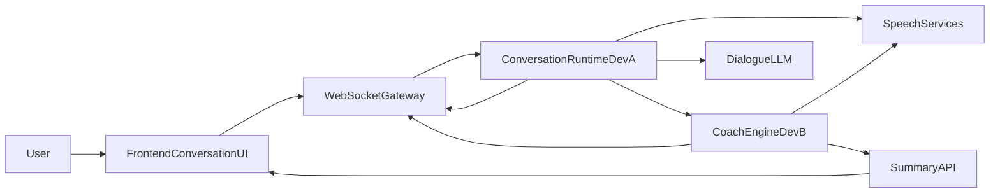

# AI Speaking Coach 双人协作拆解与接口规范

更新时间：2026-06-06

适用范围：`AI-Speaking-coach` 当前版本的双人并行开发、联调与接口冻结

参考来源：
- `ai-coding/speaking-coach.md`
- `ai-coding/plan/00 · Skeleton & Contracts.md`
- `ai-coding/plan/A Conversation 模块开发（Dev A 独占）.md`
- `ai-coding/plan/B · Coach 模块开发（Dev B 独占）.md`
- 根目录 `PROTOCOL.md`
- 当前仓库已有 skeleton 代码

---

## 1. 结论摘要

现有计划的整体方向是对的，尤其是以下几点值得保留：
- 采用 `Vue + FastAPI + WebSocket` 的实时交互骨架是合理的。
- 用场景化会话驱动产品体验，而不是做纯评分工具，方向正确。
- 按 `conversation` / `coach` 两个模块切分，适合两人并行开发。
- 用事件总线解耦“主对话链路”和“纠错/总结链路”，是正确思路。

但如果目标从“可演示 Demo”提升为“更接近真实口语陪练题目要求”，现有方案还有 6 个关键问题需要修正，否则后续会出现偏题、联调反复或接口不稳。

---

## 2. 对现有计划的主要问题判断

### 2.1 对“实时语音对话”的定义偏保守

现有方案把实时定义为“按住说话、松手后整轮返回”。这适合 Demo，但与题目强调的“真实对话训练”和“端到端流畅性、延迟性”仍有差距。

建议修正为：
- **P0 必做**：持续连接的准实时回合制。前端在一个会话内持续传音，服务端返回 `asr_partial`，用户结束一轮后快速得到 AI 回复、发音结果和纠错。
- **P1 可选**：自动静音断句（VAD）、更自然的“无需一直按住”的轮转。
- **P2 后续**：真正全双工、可打断式 TTS、边听边说。

结论：本期不必强上全双工，但不能仍然只按“松手才看到所有结果”的最简 Demo 方案设计。

### 2.2 教练能力被拆散在两个模块中，边界不够干净

现有设计里：
- Dev A 负责 STT、TTS、LLM 对话、发音评测
- Dev B 负责纠错、总结、评分

这会导致“口语能力评估”被拆成两半：发音在 A，表达与总结在 B。后续很容易出现：
- 发音分在 A 模块展示
- 语法纠错在 B 模块展示
- 总结页却需要同时汇总 A/B 的数据

建议修正为：
- **Dev A 只负责 Conversation Runtime**：音频接入、会话状态、ASR、对话生成、TTS、前端会话流转。
- **Dev B 统一负责 Coach Intelligence**：发音评测、语法/表达纠错、回合分析汇总、课后总结、量化反馈。

这样“教练视角”的所有数据由 B 统一生产，A 只消费分析结果并展示。

### 2.3 WebSocket 契约过粗，缺少回合状态和关联字段

当前 `PROTOCOL.md` 只定义了基本事件类型，但缺少以下关键字段：
- `request_id` / `event_id`
- `session_id` / `turn_id` 的全链路关联规则
- 回合状态事件，例如 `turn_started`、`assistant_started`、`assistant_finished`
- 时间戳、延迟观测字段
- 前端如何区分“识别中 / 分析中 / AI 回复中 / 本轮结束”

建议把协议升级为“**状态机化的 WS 协议**”，至少保证：
- 前端知道当前轮处于哪个阶段
- Dev A / Dev B 都能用 `turn_id` 对齐事件
- 纠错和发音结果即使异步到达，也能稳定挂到同一轮

### 2.4 量化反馈不足，无法真正支撑“能力提升可衡量”

当前总结接口只有：
- `pron_avg`
- `accuracy_avg`
- `fluency_avg`
- `completeness_avg`
- `corrections_count`

这还不够。题目要求是“口语能力提升的可量化反馈”，至少还需要：
- `grammar_score`
- `expression_score`
- `vocabulary_score`
- `latency_metrics`（如平均响应时延、平均单轮时长）
- `focus_recommendations`（本次优先改进点）
- `trend_hint`（如本次相对前几轮的变化）

如果不补这部分，课后总结会更像“结果回显”，而不是“学习反馈”。

### 2.5 会话生命周期定义不完整，容易引发联调问题

当前规划里 Conversation 和 Coach 分别维护自己的会话数据，且当前代码中 `session_end` / disconnect 后会直接清理会话。这样很容易出现：
- 总结页请求时，A 已经清掉会话状态
- B 还没来得及写完该轮分析
- 最终 `summary` 404 或数据不全

建议冻结以下规则：
- `session_end` 只表示“用户结束练习”，不等于“立刻删除会话数据”
- 会话数据应至少保留到 summary 拉取完成
- Coach 模块以 `session_id + turn_id` 为唯一主键聚合分析数据
- 会话清理由显式的 `summary_ack` 或定时 TTL 完成

### 2.6 当前实现状态已经和“目标题目”存在差距

仓库当前已有 skeleton 代码，但仍主要停留在 mock 阶段：
- `backend/app/modules/conversation/router.py` 仍用 `_mock_turn_payload()`
- `backend/app/modules/coach/turn_handler.py` 为空实现
- 当前路由由 Conversation 直接发送 `correction`，没有真正完成 A/B 解耦

这说明现在最需要的不是继续写松散计划，而是**先冻结新的边界和接口**，避免两个人按不同理解同时往前写。

---

## 3. 推荐目标范围

## 3.1 P0 必做范围

本期建议交付目标定义为：**准实时、强反馈、可量化的英语口语训练工具**。

P0 必做能力：
- 场景选择：面试 / 点餐 / 会议
- 持续会话连接
- 音频分片上传
- `asr_partial` 中间识别结果
- 单轮结束后快速产出 AI 回复
- 发音评测（单轮）
- 语法 / 表达纠错（单轮）
- 课后总结（整场）
- 至少 6 个量化指标
- 明确的回合状态事件

### 3.2 P1 可选增强

- 自动静音断句（VAD）
- TTS 分片返回，而不是整段 base64 一次性返回
- 纠错气泡更靠近回复时机
- 历史轮次趋势分析

### 3.3 P2 后续演进

- 真正全双工
- 用户打断 AI 说话
- 个性化复习和错题本
- 跨会话能力成长曲线

---

## 4. 推荐架构与数据流



推荐的数据流顺序：

1. 前端建立单个会话 WS 连接。
2. 用户说话时持续发送音频分片。
3. Dev A 负责流式 ASR，持续回推 `asr_partial`。
4. 一轮结束后，Dev A 产出 `transcript_final` 并生成 AI 回复。
5. Dev A 发布 `TurnTranscriptReadyEvent` 给 Dev B。
6. Dev B 基于音频 + transcript 做发音评测、纠错和回合评分。
7. Dev B 将 `analysis.pronunciation`、`analysis.correction` 回推前端。
8. 会话结束后，前端调用 summary API 获取整场总结。

关键原则：
- **AI 回复链路**和**教练分析链路**并行，而不是串行。
- **发音评测和纠错**都归 Coach 模块统一产出。
- **前端展示层只消费冻结契约，不直接拼接跨模块私有数据**。

---

## 5. 双人开发拆解建议

## 5.1 Dev A：Conversation Runtime

Dev A 负责“用户说话到 AI 回话”的主链路闭环。

职责边界：
- 前端会话页、录音控制、实时字幕区、AI 回复播放
- WebSocket 连接管理
- 会话状态管理
- 音频分片接收与缓存
- ASR 适配
- 对话 LLM 适配
- TTS 适配
- turn 状态机

建议负责目录：
- `backend/app/modules/conversation/**`
- `backend/tests/conversation/**`
- `frontend/src/modules/conversation/**`

Dev A 输出给其他模块的核心产物：
- `TurnTranscriptReadyEvent`
- WS 的 `asr_partial` / `user_turn_final` / `assistant_reply_*` / `turn_state`

## 5.2 Dev B：Coach Intelligence

Dev B 负责“如何评价这一轮说得好不好、错在哪里、整场进步如何”。

职责边界：
- 发音评测
- 语法 / 表达 / 词汇纠错
- 回合分析聚合
- 总结页接口
- 量化评分模型
- 纠错面板、总结页、量化反馈 UI

建议负责目录：
- `backend/app/modules/coach/**`
- `backend/tests/coach/**`
- `frontend/src/modules/coach/**`

Dev B 输出给其他模块的核心产物：
- `analysis.pronunciation`
- `analysis.correction`
- `SessionSummaryResponse`

## 5.3 Skeleton / Shared 层

以下内容必须在 Phase 0 一次冻结：
- `backend/app/core/types.py`
- `frontend/src/core/types.ts`
- `backend/app/core/event_bus.py`
- `backend/app/core/ws_hub.py`
- `backend/app/core/scenes.py`
- `PROTOCOL.md`
- `frontend/src/core/store.ts`
- `frontend/src/core/ws.ts`
- `frontend/src/App.vue`

规则：
- Phase 0 之后，A/B 均不能随意改 shared 契约。
- 如果必须变更，必须在文档中先更新，再统一修改前后端。

---

## 6. 必须冻结的接口契约

## 6.1 WebSocket 协议建议（v2）

### Client -> Server

#### `session.start`

```json
{
  "type": "session.start",
  "session_id": "uuid",
  "scene_id": "interview",
  "difficulty": 2,
  "persona_id": "strict_interviewer",
  "client_ts": 1717651200000
}
```

#### `audio.append`

```json
{
  "type": "audio.append",
  "session_id": "uuid",
  "turn_id": "uuid-or-null",
  "seq": 12,
  "encoding": "webm_opus",
  "chunk": "<base64>",
  "is_last": false,
  "client_ts": 1717651200321
}
```

说明：
- `turn_id` 在首次录音时可为空，服务端可在 `turn.started` 中回传正式值。
- `is_last=true` 表示本轮输入结束。

#### `session.finish`

```json
{
  "type": "session.finish",
  "session_id": "uuid"
}
```

### Server -> Client

#### `session.ready`

表示会话初始化成功，前端可以开始采集和发送音频。

#### `turn.started`

```json
{
  "type": "turn.started",
  "session_id": "uuid",
  "turn_id": "uuid",
  "server_ts": 1717651200450
}
```

#### `asr.partial`

```json
{
  "type": "asr.partial",
  "session_id": "uuid",
  "turn_id": "uuid",
  "text": "I would like to...",
  "server_ts": 1717651200810
}
```

#### `user_turn.final`

```json
{
  "type": "user_turn.final",
  "session_id": "uuid",
  "turn_id": "uuid",
  "text": "I would like to order a pasta, please.",
  "duration_ms": 2840,
  "server_ts": 1717651202300
}
```

#### `assistant.reply_text`

```json
{
  "type": "assistant.reply_text",
  "session_id": "uuid",
  "turn_id": "uuid",
  "text": "Certainly. Would you like anything to drink with that?"
}
```

#### `assistant.reply_audio`

```json
{
  "type": "assistant.reply_audio",
  "session_id": "uuid",
  "turn_id": "uuid",
  "audio_format": "mp3",
  "data": "<base64>"
}
```

P1 可升级为 `assistant.reply_audio_chunk`。

#### `analysis.pronunciation`

```json
{
  "type": "analysis.pronunciation",
  "session_id": "uuid",
  "turn_id": "uuid",
  "overall": 78.2,
  "accuracy": 75.0,
  "fluency": 81.5,
  "completeness": 88.0,
  "words": [
    {
      "word": "pasta",
      "accuracy_score": 61.2,
      "error_type": "Mispronunciation"
    }
  ]
}
```

#### `analysis.correction`

```json
{
  "type": "analysis.correction",
  "session_id": "uuid",
  "turn_id": "uuid",
  "issues": [
    {
      "original": "I want order pasta",
      "corrected": "I want to order pasta",
      "explanation": "Use infinitive after want.",
      "category": "grammar",
      "severity": "high"
    }
  ]
}
```

#### `turn.completed`

```json
{
  "type": "turn.completed",
  "session_id": "uuid",
  "turn_id": "uuid",
  "server_ts": 1717651203900
}
```

#### `error`

```json
{
  "type": "error",
  "session_id": "uuid",
  "turn_id": "uuid",
  "code": "ASR_FAILED",
  "message": "Speech recognition returned empty result.",
  "retryable": true
}
```

推荐错误码枚举：
- `BAD_REQUEST`
- `SESSION_NOT_FOUND`
- `AUDIO_DECODE_FAILED`
- `ASR_FAILED`
- `LLM_REPLY_FAILED`
- `TTS_FAILED`
- `PRON_ANALYSIS_FAILED`
- `CORRECTION_FAILED`
- `SUMMARY_NOT_READY`

## 6.2 HTTP 接口建议

### `GET /api/scenes`

用途：获取场景、难度、persona 配置。

### `GET /api/sessions/{session_id}/status`

用途：查询会话是否存在、summary 是否可取、最后一轮处理状态。

返回字段建议：
- `session_id`
- `state`
- `summary_ready`
- `last_turn_id`
- `last_error`

### `POST /api/sessions/{session_id}/summary`

用途：获取课后总结。

请求体可为空，或后续扩展：

```json
{
  "include_turns": true
}
```

## 6.3 内部事件总线契约

### `TurnTranscriptReadyEvent`（Dev A -> Dev B）

```json
{
  "session_id": "uuid",
  "turn_id": "uuid",
  "scene_id": "interview",
  "difficulty": 2,
  "persona_id": "strict_interviewer",
  "transcript": "I would like to order a pasta, please.",
  "wav_audio_b64": "<optional-base64>",
  "assistant_reply_text": "Certainly. Would you like anything to drink with that?",
  "turn_duration_ms": 2840
}
```

说明：
- 若评测引擎需要原始音频，必须在事件内明确带上可消费的音频数据或文件引用。
- 不能只传 transcript，否则 Dev B 无法独立完成发音评测。

### `TurnAnalysisReadyEvent`（Dev B -> WS / Summary Store）

```json
{
  "session_id": "uuid",
  "turn_id": "uuid",
  "pronunciation": {},
  "corrections": [],
  "grammar_score": 72,
  "expression_score": 76,
  "vocabulary_score": 70
}
```

---

## 7. 共享数据模型建议

## 7.1 CorrectionIssue

建议在现有字段基础上新增：
- `severity: "high" | "medium" | "low"`
- `span_text` 或沿用 `original`

原因：
- 前端需要决定纠错何时提示、是否高亮
- summary 需要按严重程度排序

## 7.2 SessionSummaryResponse

建议从当前结构扩展为：

```json
{
  "session_id": "uuid",
  "scene_id": "interview",
  "total_turns": 4,
  "pron_avg": 78.2,
  "accuracy_avg": 75.0,
  "fluency_avg": 81.5,
  "completeness_avg": 88.0,
  "grammar_score": 72.0,
  "expression_score": 76.0,
  "vocabulary_score": 70.0,
  "corrections_count": 5,
  "avg_response_latency_ms": 1260,
  "ai_feedback": "......",
  "focus_recommendations": [
    "重点练习多音节词重音",
    "减少中文式省略结构"
  ],
  "turns": []
}
```

这组字段才能比较完整地支撑“可量化反馈”。

---

## 8. 双人开发阶段建议

## 8.1 Phase 0：冻结 shared 层

目标：
- 确认目录边界
- 冻结 WS/HTTP/事件总线契约
- 同步前后端共享类型

完成标准：
- `PROTOCOL.md`
- `backend/app/core/types.py`
- `frontend/src/core/types.ts`
- `backend/app/core/event_bus.py`
- `frontend/src/core/store.ts`

以上文件完成一次统一确认后再冻结。

## 8.2 Phase A：并行开发

### Dev A

- 完成会话连接与音频上传
- 完成 `asr.partial`
- 完成 transcript final / AI reply / TTS
- 保证前端可完成完整一轮对话

### Dev B

- 完成发音评测链路
- 完成纠错链路
- 完成回合分析存储
- 完成总结接口和总结页

## 8.3 Phase B：联调

联调只关注三条链路：
- 同一 `turn_id` 是否贯穿所有事件
- 纠错/发音结果是否能稳定落在对应轮次
- session 结束后 summary 是否稳定可取

---

## 9. 对当前仓库的具体修正建议

基于当前代码状态，建议优先修正以下内容：

1. `backend/app/modules/conversation/router.py`
   - 去掉由 Conversation 直接发送 `correction` 的逻辑
   - 改为只负责主链路与发布 `TurnTranscriptReadyEvent`

2. `backend/app/modules/coach/turn_handler.py`
   - 从空实现升级为真正的分析消费者
   - 接收 transcript + 音频，产出发音评分和纠错

3. `backend/app/modules/conversation/session_manager.py`
   - 补充 turn 状态和可消费音频缓存
   - 明确 session 结束后数据保留策略

4. `backend/app/core/types.py` 与 `frontend/src/core/types.ts`
   - 增加 severity、grammar_score、expression_score、vocabulary_score、latency 字段
   - 同步升级事件命名

5. 根目录 `PROTOCOL.md`
   - 从当前 v1 升级到支持回合状态与分析事件的版本

---

## 10. 最终建议

如果目标是更贴近题目要求，而不是只交一个最小演示版，那么最关键的不是“继续扩功能”，而是先统一以下三个判断：

1. 本期目标应是“准实时自然回合制”，而不是“纯按住说话 Demo”。
2. 发音评测、纠错、总结应统一归到 Coach 模块，避免能力拆散。
3. 所有跨人协作内容必须先冻结契约，再分别实现。

基于以上原则，当前仓库完全可以继续沿用现有结构，不需要推倒重来；但需要在正式开发前先做一次 shared contract 升级。
